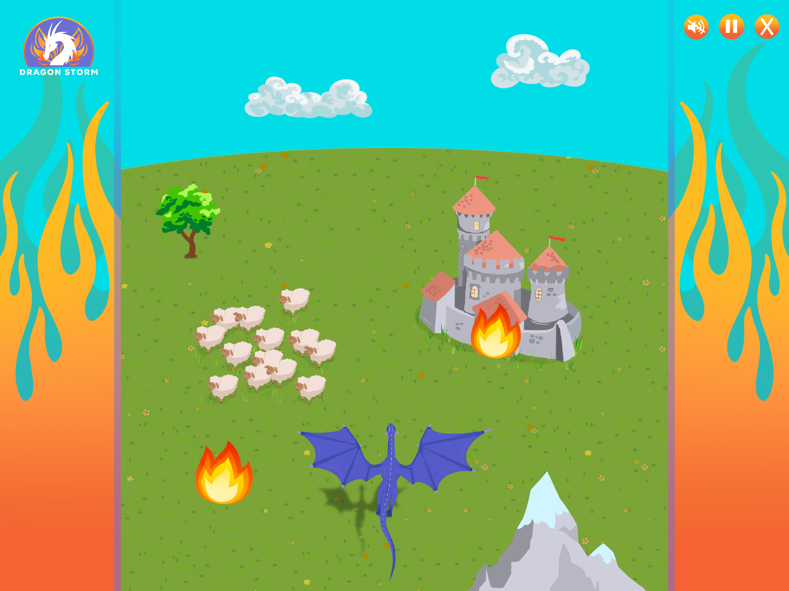

# Welcome to ~


As you fly over the span of a green medieval countryside, signs of human civilization will begin to appear from the horizon. Your dragon duties include burning down as many structures/targets as you can, for as long as you can. As you continue to soar and light up the countryside with fire, the dragon will gradually fly faster and faster from excitement, causing it to become more difficult to fly and aim. With this is mind, you must also avoid the dangerous mountains that will hurt the dragon and end the game if you fly into one!


### In order to *fly*, use the following keyboard keys to move:
```
Left Arrow, Right Arrow, Up Arrow, or Down Arrow
```
### In order to *blow fire*, press the:
```
SPACE KEY
```

### Structures / targets to light on fire:
  - `Castles: 10 pts`
  - `Villages: 8 pts`
  - `Homes: 6 pts`
  - `Sheep: 4 pts`
  - `Trees: 2 pts`

### Obstacles to **AVOID**:
  - `Mountains` - GAME OVER

---
## Functionality & MVPs

Dragon Storm will allow users to:
  - Play a new game, start/pause a current game, mute/unmute sound, exit current game
  - Move the dragon using arrow keys
  - Blow fire using the space key

In addition, the game will include:
  - An instructions module providing overview and directions on how the game is played
  - A production README

## Wireframes



- Buttons on the top right corner for mute/unmute, play/pause, and exit game
- Logo in top left will bring you back to the home page with main logo and instructions module
- In the lower right and left corners, I will later add buttons/links for my Github, LinkedIn, etc...

## Technologies, Libraries, APIs

This game will be implemented using:
  - The *Canvas API* to render game board/background
  -  *Webpack* and *Babel* to bundle and transpile the source Javascript code
  -  *npm* to manage project dependencies

## Implementation Timeline

  - ***Friday Afternoon & Weekend:***
    - Setup project- get webpack up and running
    - Get canvas to render background image
    - Finish finding art to use for game
    - Create *Grid*, *movingObject*, *Dragon*, *Castle*, *Tree*, *Sheeps*, *Village*, and *Mountain* classes
    - Get grid to render initial state of the Dragon
  - ***Monday:***
    - Create home page with logo image
    - Include instructions module, start game buttons
    - Figure out how to use canvas to manipulate elements on the grid
    - Pick music and sound effects
    - Get the elements to move vertically down the page from the horizon
    - Alter the elements so they start off small and get bigger and they are rendered on the grid
  - ***Tuesday:***
    - Add clouds to the upper part of the canvas that will move horizonally across the page
    - Tie in keyboard mobility to the dragon so that it will be able to move
    - Add keyboard controls to that the dragon can blow fire
    - Make sure the elements light on fire when they are hit- switch on-fire class from false=true
  - ***Wednesday:***
    - Add funcionality to nav button on home page and game page
    - Make sure nav buttons work properly and redirect/make appropriate changes on click
    - Focus on styling texts and fine tune formatting
  - ***Thurday Morning:***
    - Fine tune any last things
    - Put project onto GitHub pages

## Bonus Features

  - Allowing the user to choose which color dragon before starting the game
  - Allowing the user to choose a night theme in addition to the daytime theme
  - Adding more obstacles for the Dragon to avoid